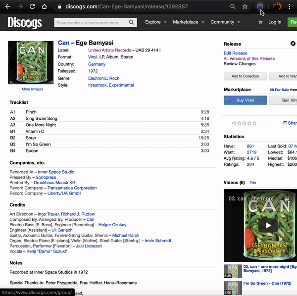

# RYM Add Helper

Chrome extension to facilitate music release adding on [RateYourMusic](https://rateyourmusic.com/) (RYM).

[Available in the Chrome Web Store](https://chrome.google.com/webstore/detail/rym-add-helper/einfkiigmefpijdgkijkcmccpihacifc/related).

## Features

- Injects a [preact](https://github.com/preactjs/preact) app which guides users through an DOM element selection process to prune metadata from any arbitrary webpage.
- Transforms text in accordance with RYM [capitalization rules](https://rateyourmusic.com/wiki/RYM:Capitalization). Utilizes heuristic-based NLP libraries [compromise](https://github.com/spencermountain/compromise) and [franc](https://github.com/wooorm/franc) for compact language detection and parts-of-speech processing.
- Launches new tab on the RYM release add page and fills out form via [jQuery](https://github.com/jquery/jquery).
- Leverages [finder](https://github.com/antonmedv/finder) to create site-specific CSS selector maps, persisted in Chrome storage, such that subsequent invocations on a given site will be carried out with a single click.
- Includes several default templates: [Discogs](https://www.discogs.com/), [Bandcamp](https://bandcamp.com/), [Spotify](spotify.com), [Metal-Archives](https://www.metal-archives.com/), [Boomkat](https://boomkat.com), [MusicBrainz](https://musicbrainz.org/).

## Demos

### Selecting Elements

### Loading from Template

## Setup

1. `git clone https://github.com/rpeg/rym-add-helper.git`
2. `npm i && npm run-script build`
3. Load unpacked extension from `/dist` via `chrome://extensions/`
